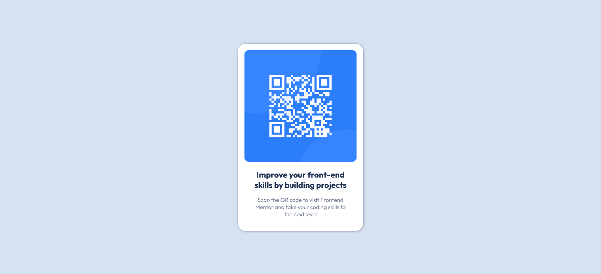

# Frontend Mentor - QR code component solution

This is a solution to the [QR code component challenge on Frontend Mentor](https://www.frontendmentor.io/challenges/qr-code-component-iux_sIO_H). Frontend Mentor challenges help you improve your coding skills by building realistic projects. 

## Table of contents

- [Overview](#overview)
  - [Screenshot](#screenshot)
  - [Links](#links)
- [My process](#my-process)
  - [Built with](#built-with)
- [Author](#author)
- [Acknowledgments](#acknowledgments)

## Overview

### Screenshot

### Links

- Solution URL: [Github Repo](https://github.com/fritzadelbertus/FEM_QR-Code-Component)
- Live Site URL: [Github Pages](https://fritzadelbertus.github.io/FEM_QR-Code-Component/)

## My process

### Built with

- JSX Component
- SCSS
- Mobile First Design

## Author

- Website - [Fritz Adelbertus Sitindaon](https://www.furitsu.site)
- Frontend Mentor - [@fritzadelbertus](https://www.frontendmentor.io/profile/fritzadelbertus)

## Acknowledgments

Thank you to FrontEnd Mentor for providing this challenge. Really make me refresh the basic knowledge of HTML and CSS.
